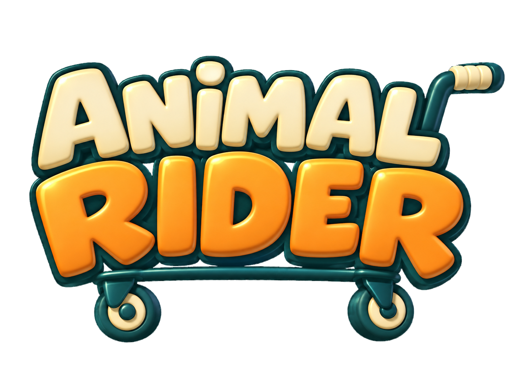

# ANIMAL RIDER

<p align="center">
  
</p>

> 동료들과 카트를 움직이고, 장애물을 넘어 화물을 목적지까지 운송하는 최대 4인 협동 게임.

[게임 소개](#introduction) · [프로젝트 개요](#overview) · [플레이 방법](#how-to-play) · [핵심 기능](#features) · [사용 기술](#technology) · [실행 방법](#getting-started) · [팀원 및 기여 내용](#team)

<a id="introduction"></a>

## 1. 게임 소개

고양이, 강아지, 고릴라, 수달이 함께 카트를 밀며 화물을 운송합니다. 카트를 잡은 위치에 따라 이동과 회전이 달라지므로, 동료들과 힘과 방향을 맞춰야 합니다. 흔들리는 길과 장애물을 넘어 화물을 지키고 목적지에 도착하세요.

<!-- IMAGE: cover — 여러 플레이어가 카트를 함께 움직이는 대표 이미지 또는 GIF -->

| 대표 이미지 / 플레이 GIF |
| :---: |
| **사진 추가 예정** |
| 여러 플레이어가 카트를 잡고 장애물을 통과하는 장면 |

| 플레이 영상 | 실행 파일 |
| :---: | :---: |
| 링크 추가 예정 | 배포 링크 추가 예정 |

<a id="overview"></a>

## 2. 프로젝트 개요

| 항목 | 내용 |
| --- | --- |
| 장르 | 물리 기반 협동 운송 게임 |
| 플레이 인원 | 최대 4인 |
| 플랫폼 | Windows PC |
| 개발 기간 | 추가 예정 |
| 엔진 | Unreal Engine 5.8 |
| 개발 언어 | C++, Blueprint |
| 개발 IDE | JetBrains Rider |
| 멀티플레이 | 리슨 서버, Online Subsystem Steam, Steam Sockets |
| 제작 도구 | Unreal Editor, Blender |

<a id="how-to-play"></a>

## 3. 플레이 방법

### 게임 흐름

```text
방 생성 / 참가 → 로비 준비 → 화물 적재 → 협동 운송 → 결과 확인 → 로비 복귀
```

로비에서 모두 준비하면 게임 맵으로 이동합니다. 60초의 준비 시간 동안 카트에 실은 화물을 운송하며, 목적지에서 배송 수량·점수·소요 시간을 확인합니다.

### 성공·실패 조건

| 상황 | 처리 |
| --- | --- |
| 화물을 싣고 목적지에 도착 | 배송 수량과 화물 생존율이 클리어 조건을 충족하면 성공 |
| 운송 대상 화물을 모두 잃음 | 기본 규칙에서 게임 오버 |
| 빈 카트로 목적지에 도착 | 배송 실패 |
| 준비 종료 시 적재된 화물이 없음 | 로비로 복귀 |

### 조작 안내

| 동작 | 키 / 입력 | 사용 조건 |
| --- | --- | --- |
| 캐릭터 이동 / 카트 밀기 | `W` `A` `S` `D` | 카트를 잡은 상태에서는 카트 조작 |
| 시점 회전 | 마우스 이동 | 주변 둘러보기 |
| 점프 | `Space` | 카트를 잡고 있지 않을 때 |
| 화물 잡기 / 놓기 | `E` | 한 번 누르면 잡고, 다시 누르면 놓기 |
| 카트 잡기 / 놓기 | `Q` | 카트 가까이에서 카트를 바라보고 사용 |
| 브레이크 | `S` | 카트 손잡이 중 하나를 잡고 있을 때 |
| 감정 표현 | `1` `2` `3` `4` | 손에 아무것도 들고 있지 않을 때 |
| 준비 / 준비 취소 | `R` | 로비에서 사용 |
| 텍스트 채팅 | `Enter` / `Esc` | `Enter`로 입력 시작, `Esc`로 취소 |
| 메뉴 열기 / 닫기 | `Esc` / `P` | 온라인 게임 진행은 계속됨 |

화물과 카트를 동시에 잡을 수 없습니다.

<a id="features"></a>

## 4. 핵심 기능

- **협동 카트 조작:** 6개 조작 위치에 가해지는 힘을 조율해 카트를 밀고 방향을 바꿉니다.
- **화물 적재·배송:** 물체를 잡아 카트에 싣고 운송하며, 도착한 화물의 수량과 점수를 확인합니다.
- **맵·장애물:** 흔들리는 도로, 바람, 발사체를 피해 카트의 방향과 속도를 조절합니다.
- **Steam 멀티플레이:** 방 생성·검색·참가와 로비 준비 상태 동기화를 지원합니다.
- **캐릭터 꾸미기:** 동물 4종 선택, 감정 표현, 3D 미리보기, 모자 선택·해금과 진행 정보 저장을 제공합니다.

### 플레이 이미지

<!-- IMAGE: feature-cart / feature-cargo / feature-map / feature-lobby / feature-character -->

| 기능 | 사진 / GIF 영역 |
| --- | :---: |
| 협동 카트 조작 | **사진 추가 예정** — 여러 위치에서 카트를 미는 장면 |
| 화물 적재·배송 | **사진 추가 예정** — 화물을 싣는 장면 또는 배송 결과 화면 |
| 맵·장애물 | **사진 추가 예정** — 대표 지형과 장애물 구간 |
| 멀티플레이 로비 | **사진 추가 예정** — 플레이어가 모여 준비하는 화면 |
| 캐릭터 꾸미기 | **사진 추가 예정** — 캐릭터 미리보기와 모자 선택 화면 |

<a id="technology"></a>

## 5. 사용 기술과 도입 이유

| 기술 | 도입 이유와 적용 |
| --- | --- |
| **Chaos Physics** | 잡은 위치가 이동·회전에 반영되도록 `AddForceAtLocation`으로 앵커별 힘 적용. 서버 물리와 클라이언트 메시 보간으로 움직임 동기화 |
| **UMG · MVVM** | 화면과 게임 로직을 분리하기 위해 ViewModel로 UI 상태를 관리하고 C++에서 위젯에 주입 |
| **GameMode · GameState · C++ 인터페이스** | 서버에서 진행 규칙을 판단하고 상태·결과를 공유. 적재 목록과 상대 좌표를 사용해 준비 단계의 카트·화물을 함께 이동 |
| **서버 RPC · Online Subsystem Steam · Steam Sockets** | 방 생성·검색·참가를 지원하고, 소유 캐릭터를 통해 전달된 상호작용 요청을 서버에서 검증 |
| **Enhanced Input** | 이동·잡기·감정 표현을 액션 단위로 관리하고 상황별 입력 매핑 구성 |
| **IK Rig · IK Retargeter** | 본 체인·기준 자세·이동량을 보정해 기존 애니메이션을 동물 캐릭터에 재사용 |
| **Landscape · Spline · Modeling Mode** | 야외 지형과 구조물을 제작하고 곡선 도로·이동 경로 구성 |
| **PCG · Foliage** | 식생과 소품 배치를 규칙화해 반복 작업을 줄이고 수동으로 세부 조정 |

<a id="getting-started"></a>

## 6. 실행 방법

### 개발 환경

| 준비 항목 | 기준 |
| --- | --- |
| 운영체제 | Windows |
| 엔진 | Unreal Engine 5.8 |
| 개발 IDE | [JetBrains Rider](https://www.jetbrains.com/help/rider/Unreal_Engine__Before_You_Start.html) |
| C++ 빌드 도구 | 엔진 버전에 맞는 MSVC와 Windows SDK |
| 버전 관리 | Git, Git LFS |
| 온라인 테스트 | 참가자별 PC·Steam 계정, Steam 실행 및 로그인 |

### 프로젝트 실행

**1. 저장소와 에셋 받기**

```powershell
git lfs install
git clone https://github.com/NBcampUnrealTrack/9th-Team7-CH4-Project.git
cd 9th-Team7-CH4-Project
git lfs pull
```

`.uasset`과 `.umap`은 Git LFS로 관리합니다. 이미 복제한 저장소에서는 `git lfs pull`로 에셋을 내려받습니다.

**2. 빌드 및 실행**

1. Rider에서 `Ch4_multiGame.uproject`를 엽니다.
2. 에디터 타깃 `Ch4_multiGameEditor`를 `Development` / `Win64` 구성으로 빌드합니다.
3. Unreal Editor에서 프로젝트를 열고 시작 맵 `/Game/Maps/L_MainMenu`를 실행합니다.

`ModelViewViewModel`, `OnlineSubsystemSteam`, `SteamSockets` 및 `Plugins` 폴더의 플러그인이 필요합니다. 전체 의존성은 `.uproject`와 `Ch4_multiGame.Build.cs`에서 확인합니다.

### Steam 멀티플레이

참가자는 같은 버전의 패키징 빌드와 각자의 Steam 계정을 사용합니다. 호스트가 방을 생성하면 나머지 플레이어가 방 목록에서 참가하고, 로비에서 모두 준비한 뒤 게임을 시작합니다.

개발 설정: `DefaultPlatformService=Steam`, `SteamDevAppId=480`.

### 테스트

UE Automation 테스트에는 게임 진행, 화물·카트, 로비·Steam 세션, UI·캐릭터 입력 검증 코드가 포함돼 있습니다. 에디터 테스트는 Session Frontend → Automation의 `Ch4_multiGame` 그룹에서 실행합니다.

네트워크 런타임 테스트는 별도 실행 조건이 필요합니다. `Ch4_multiGame.Cart.RuntimeNetworkGrab`은 리슨 서버·클라이언트와 `-Ch4CartGrabNetworkFixture` 인자를 사용합니다.

<a id="team"></a>

## 7. 팀원 및 기여 내용

| 팀원 | 담당 분야 |
| --- | --- |
| **오태양** | UI/UX · UI 시스템 연동 |
| **최현준** | 캐릭터·애니메이션 에셋 · 로비·상점 맵 · 사운드 제작 |
| **김현승** | 레벨 디자인 · 맵 시스템·장애물 |
| **양석현** | 게임 진행 · 화물·멀티플레이 시스템 |
| **정용준** | 플레이어 조작 · 애니메이션 연동 |
| **홍승표** | 카트 물리 · 협동 조작 |

<details>
<summary><strong>오태양 — UI/UX</strong></summary>

- 메인·일시정지·설정·결과 화면과 HUD를 제작하고, 준비·결과 데이터를 화면과 연출에 연결했습니다.
- 세션 목록·준비 배지·네임플레이트를 구현하고 방 인원 표시, 선택 상태와 입력 포커스를 개선했습니다.
- 캐릭터 선택·3D 프리뷰·모자 착용 UI와 상호작용 안내, 화물 아웃라인·튜토리얼을 구현했습니다.
- 공통 패널·버튼·폰트 스타일을 정리하고 설정 저장 최적화, ESC 처리와 프리뷰 조명 격리를 적용했습니다.

</details>

<details>
<summary><strong>최현준 — 캐릭터·에셋·애니메이션·사운드</strong></summary>

- 동물 모델·리그·애니메이션을 제작하고 리타게팅, 스킨 웨이트·래그돌과 액세서리 장착 데이터를 보정했습니다.
- 로비·상점 맵을 제작하고, 카트·바퀴·본과 상점·직원·옷장·기획 칠판 에셋을 구성했습니다.
- BGM·효과음 에셋을 제작·추가하고 볼륨 설정을 연결했습니다. 멀티플레이 텍스트 채팅을 적용하고 영문화했습니다.
- ANIMAL RIDER 로고와 로딩 화면 이미지를 제작했습니다.

</details>

<details>
<summary><strong>김현승 — 맵·장애물</strong></summary>

- 프로토타입과 ForestLevel을 제작하고 Landscape·PCG로 지형과 환경을 구성했습니다.
- 구간 배치 시스템과 Spline 도로, 구간별 포스트프로세스·배경음악을 연결했습니다.
- 바운스·이동 컴포넌트와 바람·파도·발사체 장애물을 구현했습니다.
- 멀티플레이 구간 배치와 맵 이동, 충돌·환경 문제를 수정했습니다.

</details>

<details>
<summary><strong>양석현 — 게임 진행·멀티플레이</strong></summary>

- GameMode·GameState와 인터페이스로 진행 상태, 화물 수량·파손·배송 점수와 성공·실패 판정을 구현했습니다.
- 준비·운송·결과·로비 복귀, 적재 화물 이동·플레이어 복구를 연결하고 결과·로비 준비 UI의 기반 로직을 구현했습니다.
- 로비·Steam 세션·초대·진행 중 참가 제한을 구현하고, 진행 보상·모자 해금 기능을 개발했습니다.
- 카트 전복 방지와 기존 보간 구조를 보완하고, 준비 전환·물리 동기화·패키징 및 자동화 테스트를 정비했습니다.


</details>

<details>
<summary><strong>정용준 — 플레이어·애니메이션 연동</strong></summary>

- 이동·시점·점프·경직·감정 표현 입력과 동물별 AnimBP·몽타주를 연결했습니다.
- 화물 잡기·놓기·동기화와 카트 잡기·밀기·브레이크 모션을 구현했습니다.
- 잡기 입력 잠금, 부착 캐릭터 움직임과 래그돌 복구 등 입력·애니메이션 동기화를 개선했습니다.
- 동작별 효과음을 연결하고 로컬 재생 처리와 카메라 줌인·줌아웃을 구현했습니다.

</details>

<details>
<summary><strong>홍승표 — 카트 물리</strong></summary>

- 카트 물리와 바퀴·짐칸을 설계하고 C++ 카트 기능을 구현했습니다.
- 서스펜션과 횡방향 그립으로 카트의 흔들림·접지 반응을 구성했습니다.
- 6개 앵커에 위치별 힘을 적용해 협동 추진과 방향 전환을 구현했습니다.
- 복제용 루트와 물리 메시를 분리하고 클라이언트 보간 기본 구조를 구현했습니다.


</details>
